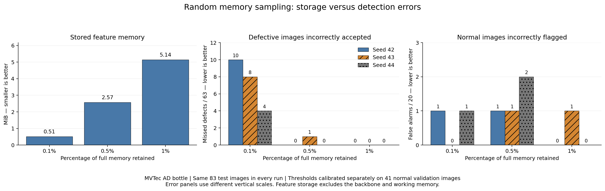
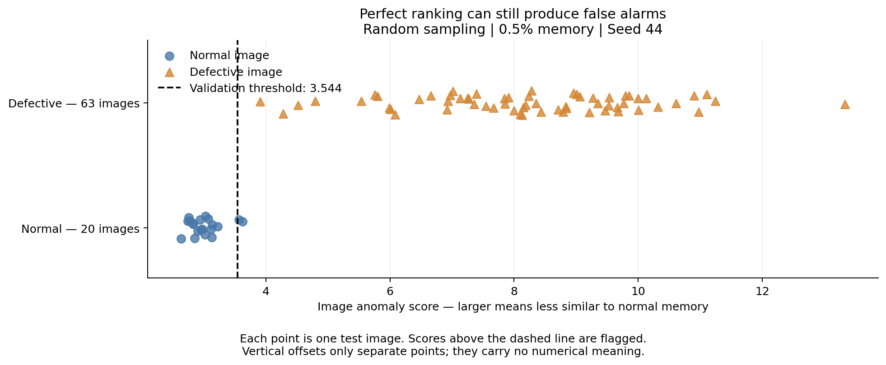

# Industrial Anomaly Detection with PatchCore-Style Features

Can an industrial defect detector retain its performance when its memory of normal examples is substantially reduced?

This project investigates that question using the **MVTec AD bottle dataset**, pretrained visual features, and nearest-neighbor anomaly scoring.

**Status:** baseline and random-memory experiments completed. Coreset comparison is planned.

## Main finding

Across three random seeds, a memory bank containing **1% of the normal training patch vectors** detected all 63 defective test images, with zero or one false alarm among 20 normal images.

Reducing the bank to **0.1%** increased missed defects to 4–10, depending on the seed.

These findings apply to the bottle test split used here. They do not establish performance on other products or production environments.

## Research foundation

The implementation is informed by [Towards Total Recall in Industrial Anomaly Detection](https://arxiv.org/abs/2106.08265) and the [official PatchCore repository](https://github.com/amazon-science/patchcore-inspection).

This is a **PatchCore-style baseline with random memory sampling**, not a complete reproduction of the published method. The completed experiments do not use coreset selection.

## Dataset

[MVTec AD](https://www.mvtec.com/research-teaching/datasets/mvtec-ad) provides normal training images, test images containing normal and defective products, and defect-location masks.

This project uses the **bottle** category.

| Split | Images | Purpose |
|---|---:|---|
| Training | 168 normal | Build the feature memory bank |
| Validation | 41 normal | Calibrate decision thresholds |
| Test | 20 normal and 63 defective | Evaluate the fixed configurations |

The 209 original normal training images were split using seed `42`. Validation and test images were excluded from memory-bank construction.

Ground-truth masks were inspected visually but were not used for training. Quantitative defect-localization evaluation has not yet been performed.

MVTec AD is distributed under **CC BY-NC-SA 4.0**. Consult the dataset provider’s terms before reuse. Dataset files are not included in this repository.

## Method

1. Resize and center-crop images to 224 × 224 and apply ImageNet normalization.
2. Extract `layer2` and `layer3` features using frozen Wide ResNet-50-2 ImageNet V1 weights.
3. Construct overlapping 3 × 3 feature neighborhoods and align the two spatial grids.
4. Pool and combine them into 784 patch vectors per image, each containing 1,024 values.
5. Store the normal training vectors in a memory bank.
6. Select a random subset of those vectors.
7. Calculate each query patch’s squared Euclidean distance to its nearest stored normal vector.
8. Use the largest patch distance as the image anomaly score.
9. Flag an image when its score exceeds a validation-derived threshold.

The neural-network weights are not updated.

## Experiment design

The full bank contains **131,712 vectors**, occupying approximately **514.5 MiB**.

Random sampling was evaluated at three memory ratios and three seeds:

- Memory ratios: 0.1%, 0.5%, and 1%.
- Seeds: 42, 43, and 44.
- Within each seed, smaller banks are subsets of larger banks.
- Each configuration receives its own threshold: the 95th percentile of normal validation scores, using `method="higher"`.
- The decision rule is `score > threshold`.

All configurations use the same cached image embeddings and test images.

The test set had already been evaluated for the initial baseline before the memory-size comparison. The subsequent results are therefore reported as follow-up benchmark experiments, not a fresh final evaluation.

## Results

| Memory retained | Vectors | Feature storage | Missed defects, seeds 42 / 43 / 44 | False alarms, seeds 42 / 43 / 44 | AUROC range |
|---|---:|---:|---|---|---|
| 0.1% | 131 | 0.51 MiB | 10 / 8 / 4 | 1 / 0 / 1 | 0.9381–0.9817 |
| 0.5% | 658 | 2.57 MiB | 0 / 1 / 0 | 1 / 1 / 2 | 0.9984–1.0000 |
| 1% | 1,317 | 5.14 MiB | 0 / 0 / 0 | 0 / 1 / 0 | 0.9976–1.0000 |

Missed defects are counted out of **63 defective images**. False alarms are counted out of **20 normal images**.

Storage refers only to the feature tensor, excluding backbone weights and working memory.

### Ranking and threshold decisions

AUROC measures score ranking across thresholds. It does not measure accuracy at one selected threshold.

For example, the 0.5% bank with seed 44 achieved AUROC 1.0 but incorrectly flagged two normal images. All defective images scored above all normal images, while the validation-derived threshold still fell below two normal test scores.

## Repository contents

- [Notebook](notebooks/01_random_memory_baseline.ipynb): implementation, explanations, and saved outputs.
- [Experiment log](experiment-log.md): settings, findings, and decisions.
- [Comparison table](results/random_memory_comparison.csv): all nine configurations.
- [Per-image scores](results/random_memory_comparison_scores.csv): validation and test scores for each configuration.
- `figures/`: exported result visualizations.

## Running the notebook

The notebook was developed in Google Colab with Google Drive storage and a CUDA runtime.

Recorded framework versions:

- PyTorch: `2.11.0+cu128`
- Torchvision: `0.26.0+cu128`

Other dependencies include NumPy, pandas, Pillow, Matplotlib, scikit-learn, and tqdm. A fully pinned dependency file has not yet been prepared.

To run:

1. Obtain the bottle dataset and store its ZIP in Google Drive.
2. Open the notebook in Colab.
3. Update Drive paths for your account. The saved notebook contains an author-specific folder name with a leading space.
4. Start with the Drive connection and dataset setup sections.
5. Run feature extraction, embedding construction, split creation, and memory-bank construction.
6. Run calibration, evaluation, caching, and random-memory experiments.
7. Generate the result charts.

The export utility at the beginning of the notebook is optional and should be run after its result files exist. Path-diagnostic cells are optional troubleshooting utilities.

Feature caches and memory banks are stored separately in Drive and are not included in GitHub. A fresh runtime requires setup and function definitions to be rerun; saved artifacts can avoid repeated feature extraction.

## Key learning points

- Pretrained features can support anomaly detection without retraining the backbone.
- Memory sampling affects both detection quality and variability between runs.
- A distance score is not a defect probability.
- Threshold calibration and independent evaluation serve different purposes.
- Perfect AUROC can coexist with false alarms at a particular threshold.
- Saving split metadata, seeds, features, and scores makes experiments easier to reproduce.

## Limitations

- Only one product category was evaluated.
- The normal validation set contains only 41 images.
- Three seeds provide an initial view of sampling variability.
- Repeated runs use the same test set and are not independent datasets.
- No quantitative localization, production deployment, or controlled runtime benchmark has been completed.
- Random sampling differs from the coreset selection used by PatchCore.

## Next steps

- Implement a documented approximation of greedy coreset selection.
- Compare it with random sampling at equal vector counts.
- Report all predefined configurations.
- Evaluate fixed settings on another category.
- Assess defect localization separately from image-level detection.

## Acknowledgments

Developed as a guided learning project with AI-assisted explanations, code development, and documentation. Experiments were executed in Google Colab.

The method builds on the PatchCore authors’ research and implementation. Consult upstream licenses and retain required attribution when reusing code.